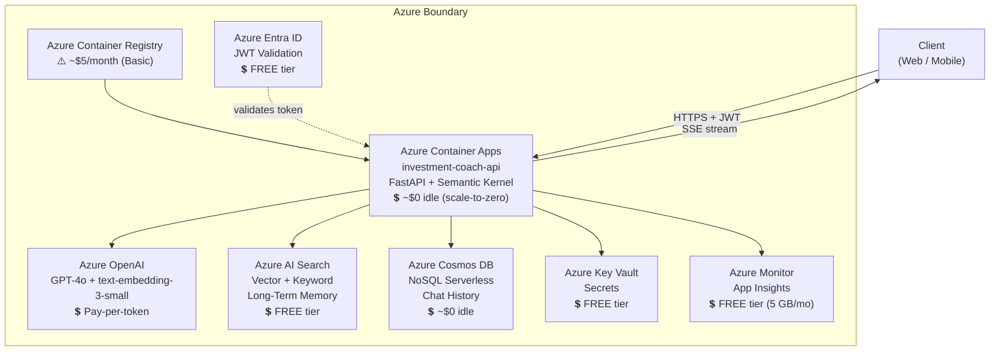
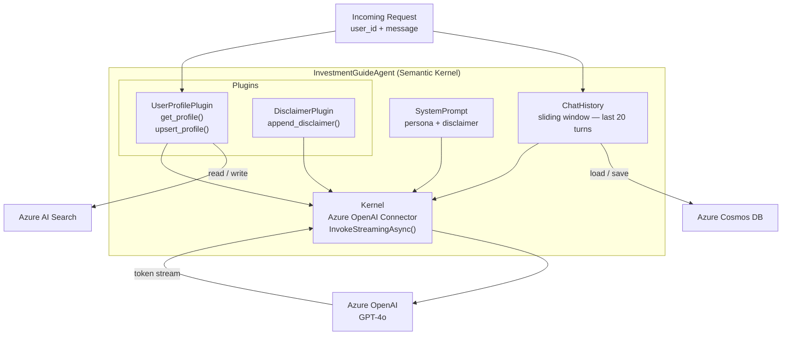
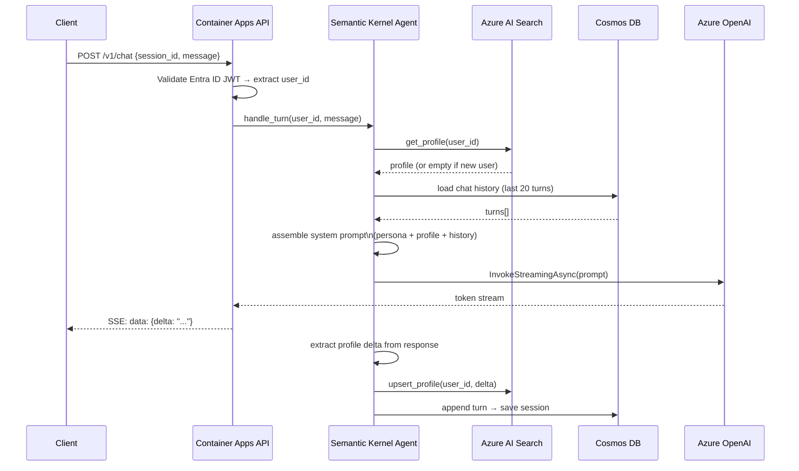
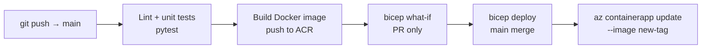

# Investment Coach Agent — Architecture Design

## 1. System Context



---

## 2. Component Design

### 2.1 Agent Core — Semantic Kernel



### 2.2 Turn Flow



### 2.3 Long-Term Memory — Azure AI Search

> **Cost: FREE tier** — 1 index, 50 MB, 3 replicas. Sufficient for showcase.
> Upgrade to Basic (~$73/month) only if index exceeds 50 MB or multiple indexes are needed.

Index schema `user-profiles`:

| Field | Type | Role |
| ----- | ---- | ---- |
| `id` | string (key) | `user_id` — direct lookup |
| `profile_json` | string | Full structured profile as JSON |
| `profile_text` | string (searchable) | Prose summary for semantic retrieval |
| `profile_vector` | Collection(Edm.Single) | Embedding of `profile_text` |
| `last_updated` | DateTimeOffset (filterable) | Staleness tracking |

- Hybrid retrieval (vector + BM25) for contextual recall
- Filter `id eq 'user_id'` for O(1) exact lookup on returning users
- Embeddings via `text-embedding-3-small` (Azure OpenAI)

### 2.4 Short-Term Memory — Azure Cosmos DB (NoSQL, Serverless)

> **Cost: Pay-per-use, ~$0 at rest.**
> ⚠️ Avoid provisioned throughput mode — minimum ~$24/month charge.

Document schema per session:

```json
{
  "user_id": "...",
  "session_id": "...",
  "turns": [{ "role": "user|assistant", "content": "...", "ts": "..." }],
  "ttl": 86400
}
```

- Partition key: `/user_id` — sub-millisecond point reads
- TTL 24 h — sessions expire automatically, no cleanup job

### 2.5 Secrets — Azure Key Vault

> **Cost: FREE** — Standard tier, first 10,000 operations/month free.

| Secret Name | Value |
| ----------- | ----- |
| `aoai-endpoint` | Azure OpenAI endpoint URL |
| `aoai-api-key` | Azure OpenAI API key |
| `ai-search-endpoint` | Azure AI Search endpoint |
| `ai-search-key` | Azure AI Search admin key |
| `cosmos-connection` | Cosmos DB connection string |

### 2.6 Observability — Azure Monitor + Application Insights

> **Cost: FREE tier** — 5 GB/month ingestion free.
> ⚠️ Set a daily ingestion cap to prevent accidental overrun beyond 5 GB.

- Structured JSON logs per turn: `user_id`, `session_id`, `prompt_tokens`, `completion_tokens`, `latency_ms`, `profile_hit`
- Alerts: p95 latency > 3 s, error rate > 1 %

---

## 3. Azure Resource Cost Summary

| Resource | SKU / Tier | Est. Monthly Cost | Notes |
| -------- | ---------- | ----------------- | ----- |
| Azure OpenAI (GPT-4o) | S0 pay-per-token | ~$0.01–0.05 per conversation | $2.50/1M input, $10/1M output tokens |
| Azure OpenAI (text-embedding-3-small) | S0 pay-per-token | < $0.01/month | $0.02/1M tokens |
| Azure AI Search | **Free tier** | **$0** | 1 index, 50 MB limit |
| Azure Cosmos DB | **Serverless** | **~$0–1** | Pay per RU; $0 when idle |
| Azure Container Apps | **Consumption** | **~$0 idle** | Charged per vCPU-sec + memory-sec only when running |
| Azure Container Registry | **Basic** | ⚠️ **~$5/month** | No free tier — only unavoidable fixed cost |
| Azure Key Vault | **Standard** | **$0** | 10k ops/month free |
| Azure Monitor / App Insights | **Free tier** | **$0** | 5 GB/month ingestion free |
| Azure Entra ID | **Free tier** | **$0** | OIDC/JWT validation free |
| **Total (showcase)** | | **~$5–10/month** | Dominated by ACR + sporadic LLM tokens |

> **Tip:** Replace Azure Container Registry with **GitHub Container Registry (ghcr.io)** — free for
> public repos, 500 MB free for private — to eliminate the only fixed cost and reach ~$0 idle.

---

## 4. Infrastructure — Resource Map

```mermaid
graph LR
    subgraph RG["rg-investment-coach-dev"]
        AOAI["Microsoft.CognitiveServices/accounts\nAzure OpenAI — S0\n💲 pay-per-token"]
        Search["Microsoft.Search/searchServices\nAzure AI Search — FREE\n💲 $0"]
        Cosmos["Microsoft.DocumentDB/databaseAccounts\nCosmos DB — Serverless\n💲 ~$0 idle"]
        KV["Microsoft.KeyVault/vaults\nKey Vault — Standard\n💲 $0"]
        ACAEnv["Microsoft.App/managedEnvironments\nContainer Apps Env — Consumption\n💲 $0"]
        ACA["Microsoft.App/containerApps\ninvestment-coach-api\n💲 ~$0 idle"]
        ACR["Microsoft.ContainerRegistry/registries\nACR — Basic\n⚠️ ~$5/month"]
        AI["Microsoft.Insights/components\nApplication Insights\n💲 $0 (5 GB free)"]
        LAW["Microsoft.OperationalInsights/workspaces\nLog Analytics\n💲 $0 (5 GB free)"]
    end
```



---

## 5. CI/CD Pipeline



> **Cost: FREE** — GitHub Actions free tier: 2,000 min/month (private), unlimited (public).

---

## 6. Local Development

| Component | Local substitute | Cost |
| --------- | ---------------- | ---- |
| Azure OpenAI | OpenAI API or same Azure sub | Pay-per-token (minimal) |
| Azure AI Search | Free tier (same as prod) | $0 |
| Cosmos DB | Cosmos DB Emulator (Docker) | $0 |
| Key Vault | `.env` with `USE_LOCAL_SECRETS=true` | $0 |
| Container Apps | `uvicorn app.main:app --reload` | $0 |

---

## 7. v2 Roadmap (Out of Scope for v1)

- Real-time market data via Azure API Management + financial data provider
- Multi-turn summarisation when chat history exceeds context window
- Proactive nudges via Azure Logic Apps
- Azure AI Content Safety filter on all LLM outputs
- Azure API Management for rate limiting and developer portal
