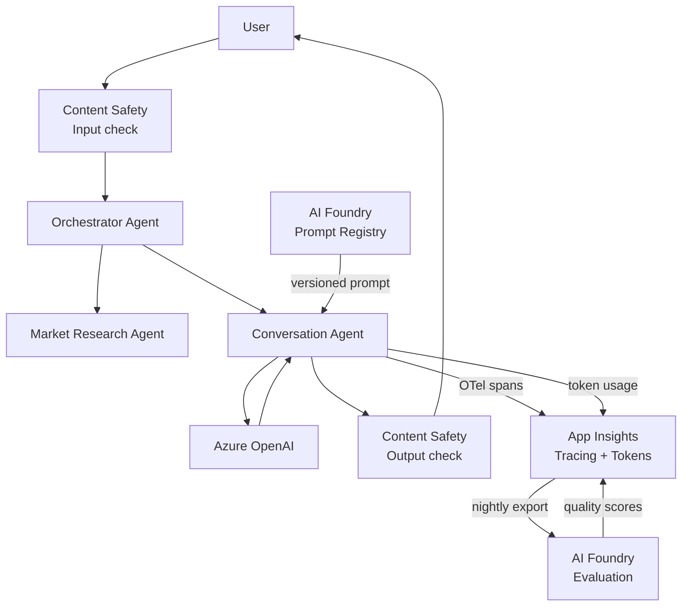

# LLMOps Plan — Investment Coach Agent

Tracks implementation progress, tradeoffs, and decisions for each LLMOps capability.

---

## Progress

| Step | Capability | Status |
|---|---|---|
| 1 | LLM Tracing — SK OpenTelemetry → App Insights | ✅ Done |
| 2 | Token cost tracking per request / user | ⏳ In Progress |
| 3 | Content Safety guardrails | ⬜ Pending |
| 4 | Prompt versioning — Azure AI Foundry | ⬜ Pending |
| 5 | Evaluation & quality metrics | ⬜ Pending |

---

## Step 1 — LLM Tracing

### What
Capture every LLM call as a structured trace: prompt, response, latency, token counts.
Visible in Azure Application Insights → end-to-end request view.

### Why
Without tracing you are flying blind — you cannot tell which agent call is slow,
which prompt is expensive, or why a response was bad.

### How
Semantic Kernel has built-in OpenTelemetry hooks.
App Insights is already wired via `APPLICATIONINSIGHTS_CONNECTION_STRING`.
Enabling SK diagnostics sends LLM spans automatically — zero new infrastructure.

### Tradeoff
| Option | Pro | Con |
|---|---|---|
| SK built-in OTel (chosen) | Zero infra, free, already wired | Limited to what SK exposes |
| Custom middleware | Full control, log anything | More code, more maintenance |
| Azure AI Foundry tracing | Rich UI, prompt comparison | Extra service, more complex setup |

### Decision
Use SK built-in OpenTelemetry. Lowest effort, zero cost, production-grade.
Upgrade to AI Foundry tracing when prompt comparison and evaluation are needed (Step 4+5).

### Implementation
- Enable `SEMANTICKERNEL_EXPERIMENTAL_GENAI_ENABLE_OTEL_DIAGNOSTICS=true`
- Enable `SEMANTICKERNEL_EXPERIMENTAL_GENAI_ENABLE_OTEL_DIAGNOSTICS_SENSITIVE=true` (logs prompts — disable in prod if PII risk)
- Add `OpenAIInstrumentor` from `opentelemetry-instrumentation-openai`
- Verify spans appear in App Insights → Transaction search

### Status
⏳ In progress

---

## Step 2 — Token Cost Tracking

### What
Log `prompt_tokens`, `completion_tokens`, `total_tokens`, and estimated cost
as App Insights custom events after every LLM call.

### Why
Token cost is the primary cost driver. Without tracking it per user/session
you cannot identify expensive users, runaway prompts, or cost anomalies early.

### How
Intercept SK streaming response metadata — it exposes token usage after the stream completes.
Emit as `customEvents` via the App Insights SDK already in the project.

### Tradeoff
| Option | Pro | Con |
|---|---|---|
| SK response metadata (chosen) | Accurate, already available | Only available after stream ends |
| API response headers | Always available | Requires custom HTTP client |
| Azure OpenAI metrics in Monitor | Zero code | Aggregated only, no per-user breakdown |

### Status
⬜ Pending

---

## Step 3 — Content Safety Guardrails

### What
Run user input and LLM output through Azure Content Safety before sending/displaying.
Block or flag: hate, violence, sexual, self-harm content.

### Why
Required for any financial advice app — prevents prompt injection, abuse, and regulatory risk.
Azure Content Safety free tier covers 5,000 calls/month — sufficient for demo.

### How
Add a `SafetyMiddleware` that calls Azure Content Safety API:
- **Input check** — before passing user message to orchestrator
- **Output check** — after LLM response, before streaming to user

### Tradeoff
| Option | Pro | Con |
|---|---|---|
| Azure Content Safety (chosen) | Native Azure, RBAC, audit log | Adds ~100–200ms latency per call |
| OpenAI moderation endpoint | Free, fast | Less granular, no Azure audit trail |
| Custom keyword filter | Zero latency | Fragile, easy to bypass |

### Cost
| Tier | Calls/month | Cost |
|---|---|---|
| Free | 5,000 | $0 |
| Standard | Unlimited | $1–2/1k calls |

### Status
⬜ Pending

---

## Step 4 — Prompt Versioning

### What
Move system prompts out of Python source code into Azure AI Foundry prompt registry.
Deploy and version prompts independently of code deployments.

### Why
Today changing a prompt requires a full Docker build + deploy cycle (~5 min).
With prompt versioning: edit in portal, deploy in seconds, roll back instantly.
Also enables A/B testing between prompt versions.

### How
- Store prompts in Azure AI Foundry prompt flow registry
- Load prompt at agent startup via AI Foundry SDK
- Tag each response with the prompt version used

### Tradeoff
| Option | Pro | Con |
|---|---|---|
| AI Foundry prompt registry (chosen) | Version control, A/B, portal UI | New service dependency |
| Azure Blob Storage | Simple, cheap | No versioning UI, manual |
| Environment variables | Zero infra | Not versionable, no history |
| Hardcoded in Python (current) | Simple | Prompt change = full redeploy |

### Status
⬜ Pending

---

## Step 5 — Evaluation & Quality Metrics

### What
Measure response quality automatically after each conversation:
- **Groundedness** — is the answer based on retrieved data?
- **Relevance** — does the answer address the question?
- **Coherence** — is the answer well-structured?
- **Safety** — does it contain harmful content?

### Why
Without evaluation you cannot tell if a prompt change improved or degraded quality.
Evaluation closes the LLMOps feedback loop.

### How
Use Azure AI Foundry Evaluation SDK — runs built-in evaluators against
conversation logs stored in Cosmos DB.
Can run on a schedule (nightly) or after each deploy as a CI gate.

### Tradeoff
| Option | Pro | Con |
|---|---|---|
| AI Foundry Evaluation SDK (chosen) | Built-in evaluators, Azure native | Requires AI Foundry workspace |
| Custom GPT-as-judge | Full control | Expensive, slow, hard to standardise |
| Human eval | Highest quality | Doesn't scale |

### Cost
AI Foundry evaluation uses Azure OpenAI calls — billed as normal tokens.
~100 eval calls/night ≈ $0.10/day at demo scale.

### Status
⬜ Pending

---

## Architecture — Full LLMOps Flow

