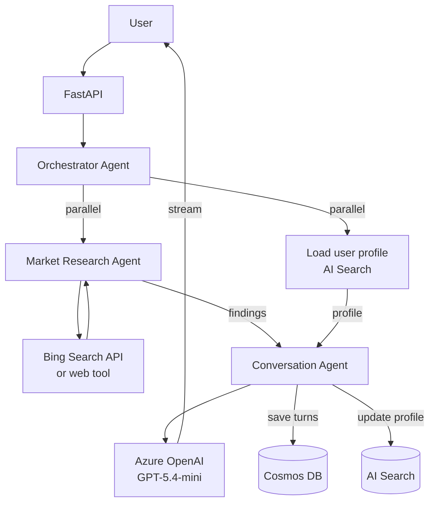
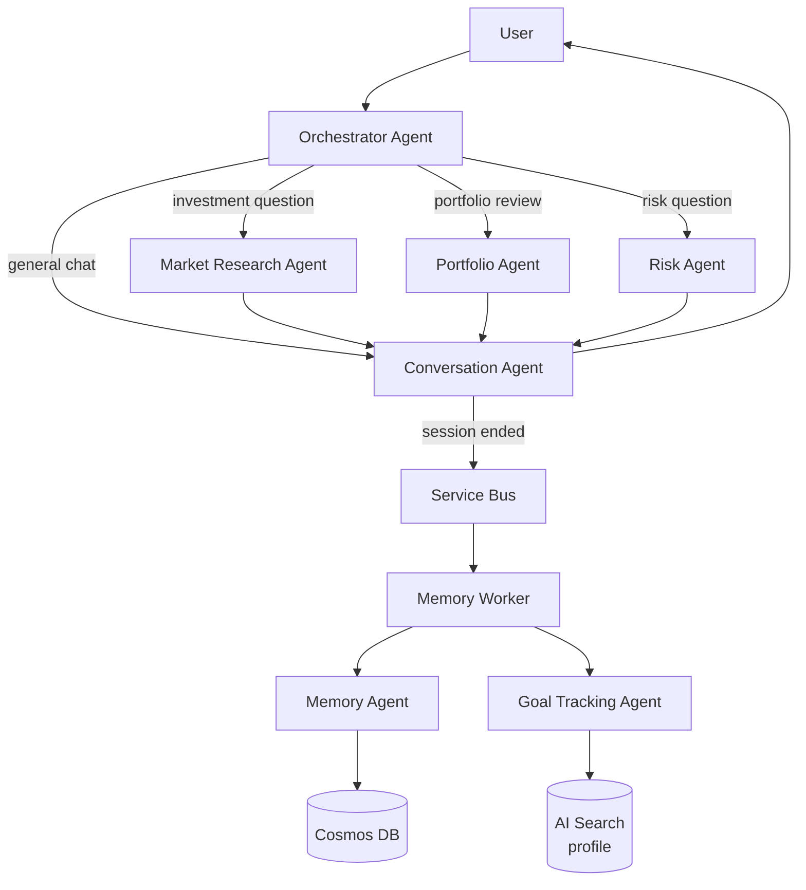

# Investment Coach Agent — MVP Product Plan

## Vision

An Azure-native multi-agent investment coach that demonstrates production-grade
agentic architecture: specialised agents, orchestration, live data, and persistent
memory — all running on Azure at near-zero cost.

---

## Agent Roster

### Phase A — Market Intelligence (current target)
| Agent | Role | Tools |
|---|---|---|
| **Orchestrator Agent** | Classifies user intent, routes to specialist agents, runs agents in parallel where possible | Intent classifier |
| **Conversation Agent** | Talks to the user, synthesises findings from other agents into a natural response | Cosmos DB history, AI Search profile |
| **Market Research Agent** | Fetches live prices, news, analyst ratings for any ticker the user mentions | Bing Search / web tool |

### Phase B — Portfolio Intelligence
| Agent | Role | Tools |
|---|---|---|
| **Portfolio Review Agent** | Analyses user's stated holdings, calculates allocation, flags concentration risk | Profile store, calculation functions |
| **Risk Assessment Agent** | Scores portfolio risk vs user's stated tolerance and time horizon, explains delta | Profile store, risk scoring |

### Phase C — Proactive Intelligence
| Agent | Role | Tools |
|---|---|---|
| **Goal Tracking Agent** | Projects whether savings rate hits user's goal by target date, surfaces warnings | Cosmos DB history, profile store |
| **Memory Agent** | Summarises old session turns, trims Cosmos DB, keeps context window small | Cosmos DB, AI Search |

---

## Phase A — Detailed Plan

### What It Demonstrates
- Orchestrator routing user intent to the right agent
- Market Research Agent using live web search (real-time data)
- Conversation Agent synthesising multi-agent findings into one coherent answer
- Why multi-agent: each agent has a single responsibility, independent failure boundary, and can run in parallel

### User Journey
```
User: "Should I buy NVIDIA right now?"

Orchestrator  → classifies: investment_question + ticker: NVDA
             → spawns Market Research Agent in parallel with profile load

Market Agent  → searches: "NVDA stock news", "NVDA analyst rating", "NVDA earnings"
             → returns: price, sentiment, key headlines

Conversation  → receives: user profile + market findings
             → responds: personalised answer grounded in live data
```

### Architecture


### New Components

#### Backend
| File | What |
|---|---|
| `backend/app/agents/orchestrator_agent.py` | Classifies intent, decides which agents to invoke, coordinates parallel execution |
| `backend/app/agents/conversation_agent.py` | Renamed from `agent.py` — chat only, receives context from orchestrator |
| `backend/app/agents/market_research_agent.py` | Searches web for ticker news, price, analyst sentiment |
| `backend/app/tools/web_search.py` | Wraps Bing Search API as a Semantic Kernel tool |
| `backend/app/routers/chat.py` | Updated — calls orchestrator instead of agent directly |

#### Infrastructure
| File | What |
|---|---|
| `infra/modules/servicebus.bicep` | Basic namespace + `session-ended` queue for async memory (Phase C) |
| `infra/modules/bing.bicep` | Bing Search resource — free tier (1,000 calls/month free) |
| `infra/main.bicep` | Wire new modules |

#### Cost Impact — Phase A
| Resource | Tier | Cost |
|---|---|---|
| Bing Search | Free (1k calls/month) | $0 |
| Service Bus | Basic | ~$0 |
| Extra OpenAI calls (orchestrator + market agent) | Pay-per-token | ~$0.01–0.05/session |
| **Total new cost** | | **~$0/month** |

### Build Order
1. `bing.bicep` — provision Bing Search
2. `web_search.py` — SK tool wrapping Bing API
3. `market_research_agent.py` — searches and returns structured findings
4. `conversation_agent.py` — slim version of current `agent.py`
5. `orchestrator_agent.py` — intent classification + parallel coordination
6. `chat.py` — wire orchestrator as entry point
7. `main.bicep` — add Bing + Service Bus modules
8. Deploy + test end-to-end

---

## Phase B — Detailed Plan

### What It Demonstrates
- Portfolio Review Agent doing multi-step analytical reasoning
- Risk Assessment Agent with its own scoring logic
- Orchestrator running Portfolio + Risk agents in parallel, merging results

### User Journey
```
User: "Review my portfolio — I hold 60% NVIDIA, 30% Apple, 10% cash"

Orchestrator  → classifies: portfolio_review
             → spawns Portfolio Agent + Risk Agent in parallel

Portfolio     → calculates allocation, flags 60% single-stock concentration
Risk          → scores risk vs user profile (conservative, 20yr horizon)
             → flags: high risk for stated tolerance

Conversation  → merges both findings
             → responds: "Your NVIDIA concentration is high for a conservative
                          investor with a 20-year horizon. Consider..."
```

### New Components
| File | What |
|---|---|
| `backend/app/agents/portfolio_agent.py` | Parses holdings, calculates allocation, flags concentration |
| `backend/app/agents/risk_agent.py` | Scores portfolio risk vs profile, explains gap |
| `backend/app/tools/portfolio_calculator.py` | Pure functions: allocation %, concentration score, diversification index |

---

## Phase C — Detailed Plan

### What It Demonstrates
- Async agents running outside the request path
- Goal Tracking Agent proactively surfacing warnings
- Memory Agent keeping context window lean as conversations grow

### User Journey
```
[Async — after session ends]

Memory Agent  → summarises 20 turns into 1 paragraph
             → saves to Cosmos DB, trims raw turns

Goal Agent   → loads profile: goal=retirement, horizon=20yr, monthly=£500
             → projects: at current rate → £180k by 2045 vs £300k needed
             → saves warning flag to profile

[Next session — user logs in]

Conversation  → loads profile, sees warning flag
             → opens with: "Since we last spoke — you may be underfunding
                            your retirement goal by £120k. Want to review?"
```

### New Components
| File | What |
|---|---|
| `backend/app/workers/memory_worker.py` | Service Bus consumer — runs Memory Agent after session ends |
| `backend/app/agents/memory_agent.py` | Summarises turns, updates Cosmos DB |
| `backend/app/agents/goal_tracking_agent.py` | Projects goal attainment, writes warning flags |
| `infra/modules/containerapps.bicep` | Add Container App Job for worker |

---

## Full Multi-Agent Flow (All Phases)



---

## Success Criteria Per Phase

| Phase | Demo shows | Definition of done |
|---|---|---|
| A | Live market data in responses | Ask about a ticker → get real news + price in answer |
| B | Personalised portfolio analysis | Paste holdings → get allocation + risk score vs profile |
| C | Proactive nudge | End session → next login shows goal tracking warning |

---

## Current Status

- [x] Phase 0 — Single agent, Cosmos DB, AI Search, deployed to Azure
- [ ] Phase A — Orchestrator + Market Research Agent
- [ ] Phase B — Portfolio + Risk Agents
- [ ] Phase C — Async Memory + Goal Tracking
